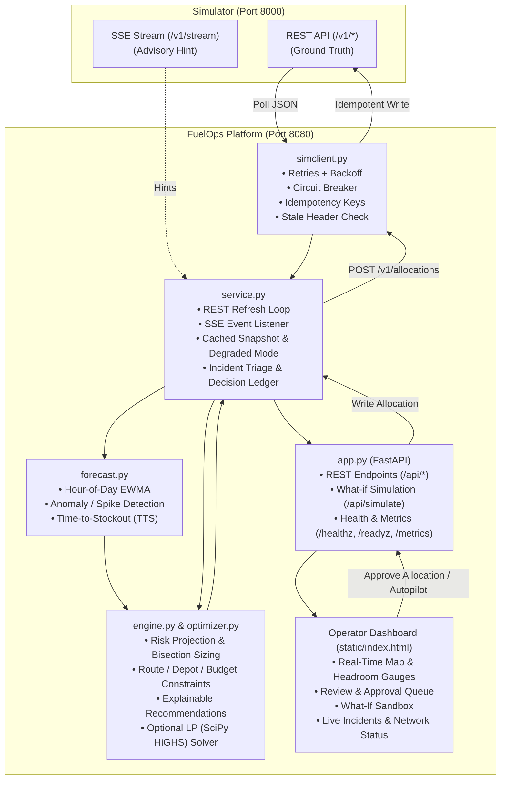

# FuelOps — Fuel Supply Intelligence & Resilience Platform

Operator dashboard + decision engine on top of the BUP Fuel Supply Simulator (BUP CSE Fest 2026 finals).

> **Verification status (read first).** All automated tests, the demo, the benchmark and the load test were run
> against a **self-written MOCK simulator** (`mocksim/`) built from the Integration Guide. The official image
> (`asifmahmoud414/bup-fuel-supply-simulator:1.0.0`) has **not** been run against this code, and Docker/compose/CI
> have **not** been executed. See `docs/project-status.md` for the full gap list.

## Architecture

FuelOps implements a closed-loop intelligence and resilience pipeline connecting the external simulator to an operator dashboard and autonomous decision engine.



### Architectural Components

| Component | Module | Responsibilities |
|---|---|---|
| **Resilient Client** | [`fuelops/simclient.py`](fuelops/simclient.py) | Communicates with Simulator via HTTP. Implements timeouts, jittered exponential backoff, circuit breaking on 503 transient faults, permanent error (400/404/409/422) handling, and idempotency headers. |
| **State & Lifecycle** | [`fuelops/service.py`](fuelops/service.py) | Background refresh loop polling REST truth and listening to SSE hints. Maintains local snapshot cache, triggers degraded mode when simulator is unreachable, triages crisis vs service faults, and maintains decision ledger. |
| **Forecasting & Anomaly** | [`fuelops/forecast.py`](fuelops/forecast.py) | De-seasonalised hour-of-day EWMA demand forecasting, z-score surge detection, and stock-out time projection. |
| **Decision & Optimizer** | [`fuelops/engine.py`](fuelops/engine.py)<br/>[`fuelops/optimizer.py`](fuelops/optimizer.py) | Sizing and allocation engine evaluating network headroom, route disruptions, and depot capacity. Generates human-explainable rationale (before/after risk, trade-offs). Includes alternative SciPy HiGHS LP formulation. |
| **Web API & Dashboard** | [`fuelops/app.py`](fuelops/app.py)<br/>[`fuelops/static/`](fuelops/static/) | FastAPI backend providing dashboard REST APIs, Prometheus telemetry, read-only what-if simulation (`POST /api/simulate`), and responsive operator UI. |

### Core Architectural Principles
1. **REST is Truth, SSE is Advisory**: State is strictly driven by REST polling; SSE events trigger accelerated re-polling rather than direct state mutation.
2. **Resilience & Degraded Mode**: Outages and injected 503 faults trigger a circuit breaker and fallback to cached snapshots with clear operator alerts.
3. **Stale Data Gating**: Allocations are blocked if state data exceeds freshness thresholds to prevent misallocations during network partitions.
4. **Idempotency & Safety**: Every write to `/v1/allocations` carries a deterministic idempotency key. Administrative reset endpoints are never exposed.
5. **Human-in-the-Loop & What-If**: Autopilot is restricted to high-confidence decisions; low-confidence cases require operator confirmation after previewing in the sandbox.

## Quick start (official simulator)
```bash
cp .env.example .env
docker compose up -d --build          # simulator (official image) + app
open http://localhost:8080            # dashboard
python scripts/demo.py                # scripted crisis story (uses /admin/step|events|faults only; never /admin/reset)
```
Local without Docker: `pip install -r requirements-dev.txt && uvicorn fuelops.app:app_factory --factory --port 8080`
(set `SIM_BASE_URL`). Mock simulator: `uvicorn mocksim.server:app --port 8000` or `docker compose --profile mock up`.

## What it does
- **Observe**: polls all REST resources (REST = truth), SSE as a hint only; stale-data header handling.
- **Detect/Predict**: hour-of-day de-seasonalised EWMA forecast, spike/anomaly detection, stock-out risk and time-to-stock-out.
- **Decide**: constrained allocation engine (default) plus an LP allocator (`fuelops/optimizer.py`, benchmarked, not default) (route status/max shipment, depot inventory, shared dispatch budget, station headroom,
  schedule-aware route disruptions) with explainable recommendations (signals, constraints, before/after risk, alternatives).
- **Simulate**: read-only what-if (`POST /api/simulate`, dashboard button) shows before/after risk without writing to the simulator.
- **Act**: operator executes/dismisses; idempotent POST /v1/allocations; optional autopilot (non-review recs only, fresh data only).
- **Resilience**: retries + backoff, circuit breaker, cached/degraded mode, stale gate, fallback threshold policy, human review on low confidence.
- **Observe the app**: JSON logs, Prometheus `/metrics`, `/healthz`, `/readyz`, service-health panel.

## Tests / evidence
`python scripts/evaluate.py --live --bench --load` (runs structure checks, 71 mock-backed tests, lint, benchmark, load test; exits 1 on required failure). Outputs in `docs/evidence/`.
Config: see `.env.example`. Docs: `docs/prompt-audit.md`, `docs/optimization-design.md`, `docs/route-and-map-analysis.md`, `docs/evaluation-plan.md`, `docs/architecture.md`, `docs/decisions.md`, `docs/test-plan.md`, `docs/requirements-traceability.md`, `docs/project-status.md`.
